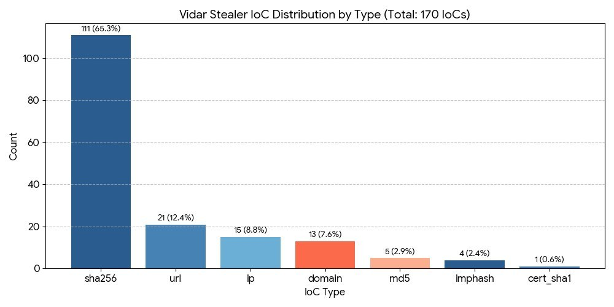

# Week 3 Report: Data Processing, Exploitation & MISP Integration

---

## 1. Objective & Scope

* **Data Normalization & Filtering:** Processing raw IOCs collected from **Unit42**, **Zscaler ThreatLabz**, **FDC-ClickFix**, and OSINT sources using automated Python logic.
* **Data Enrichment & Correlation:** Mapping technical attributes (`imphash`, `cert_sha1`, `C2 IPs`) to establish infrastructure correlation.
* **MISP Platform Integration:** Structuring dataset fields for direct import into the **MISP Threat Sharing Platform** (`misp_type`, `misp_category`, `to_ids`).
* **SIEM / Exploitation Readiness:** Engineering initial **Sigma Detection Rules** for process creation monitoring in SIEM/Elastic Stack.

---

## 2. Data Filtering & Normalization Pipeline

An automated Python script (`process_data.py`) was executed to normalize the master dataset (`data.csv`):

* **Header & Type Standardisation:** Enforced lower_snake_case headers and aligned attributes with MISP standard definitions.
* **Deduplication & Whitespace Cleanup:** Filtered out identical entries across multi-feed intelligence sources.
* **Attribute Schema Mapping:**
  * `misp_type`: `sha256`, `ip-dst`, `url`, `domain`, `imphash`, `x509-fingerprint-sha1`.
  * `misp_category`: `Payload delivery`, `Network activity`, `Payload attribute`.
  * `to_ids`: Boolean flags (`1`/`0`) specifying actionable indicators for automated firewall and EDR blocking.

---

## 3. Threat Intelligence Data Provenance & Breakdown

### A. Provenance by Source

| Source Provider | Type | IOC Volume | Primary Focus / Artifacts |
| :--- | :--- | :--- | :--- |
| **Unit42 (Palo Alto)** | Vendor Research | 110 | Campaign binary SHA256 hashes & C2 URLs |
| **Zscaler ThreatLabz** | Threat Research | 22 | Malware delivery hashes & landing pages |
| **FDC-ClickFix** | Campaign Tracking | 15 | Social engineering & fake browser update URLs |
| **ThreatFox (Abuse.ch)**| Community OSINT | 8 | Active C2 IP addresses and ports |
| **GitHub / Community** | OSINT Collection | 8 | Aggregated Vidar samples |
| **MalwareBazaar** | Sample Repository| 6 | Fresh packed executable binaries |
| **VirusTotal / Shodan**| Multi-Scanner | 1 | Verified C2 server metadata |
| **Total Indicators** | **Multi-Source** | **170** | **Normalized Master Dataset** |

### B. Indicator Type Breakdown & MISP Schema Mapping

| Indicator Type (`ioc_type`) | Volume | MISP Category | MISP Type | `to_ids` Flag |
| :--- | :--- | :--- | :--- | :--- |
| `sha256` | 111 | Payload delivery | `sha256` | True (1) |
| `url` | 21 | Network activity | `url` | True (1) |
| `ip` | 15 | Network activity | `ip-dst` | True (1) |
| `domain` | 13 | Network activity | `domain` | True (1) |
| `md5` | 5 | Payload delivery | `md5` | False (0) |
| `imphash` | 4 | Payload attribute | `imphash` | True (1) |
| `cert_sha1` | 1 | Payload attribute | `x509-fingerprint-sha1` | True (1) |

---

## 4. Data Enrichment & Correlation Analysis

1. **Behavioral Correlation via `imphash`:** 4 samples share identical Import Hashes (`imphash`), proving that despite changing SHA256 hashes due to daily re-packing, the underlying WinGo/Krypt binary structure remains identical.
2. **Infrastructure Pivoting:** Correlated C2 IP addresses with **FDC-ClickFix** URL landing pages, identifying multi-stage infection chains (Fake Update Popup -> PowerShell -> Vidar Payload -> C2 Exfiltration).
3. **MISP Event Import Readiness:** The dataset `data.csv` contains pre-formatted MISP attributes, enabling seamless CSV/JSON ingestion into a MISP instance for automated threat intelligence sharing.

---

## 5. Preliminary Sigma Rule Deployment

To meet the syllabus requirements for exploitation and SIEM deployment readiness, an initial **Sigma Detection Rule** was authored to detect Vidar Stealer execution patterns. 

* The standalone rule file is stored at `week3/vidar_execution.yml`.
* Target behavior: Execution of dropped executable binaries from user `%TEMP%` or `%APPDATA%` folders associated with cracked software or ClickFix PowerShell lures.

---

## 6. Repository Artifacts

* **`week3/process_data.py`**: Data normalization and EDA chart generation script.
* **`week3/vidar_execution.yml`**: Baseline Sigma detection rule targeting process creation.
* **`week3/ioc_distribution.png`**: Visual breakdown chart of normalized indicator types.

---
## 3. Dataset Analytics

Based on our compiled dataset `vidar_iocs_normalized.csv`, a quantitative and qualitative analysis was conducted on **170 unique Indicators of Compromise (IoCs)**.

### Key Dataset Statistics

* **Total Count:** 170 rows of unique data.

### Distribution by IoC Type
* **sha256 (File Hashes):** 111
* **url (Malicious Links):** 21
* **ip (Server Addresses):** 15
* **domain (Domains):** 13
* **md5 and imphash:** 9

### Role Analytics (Most Common Occurrences)
The overwhelming majority of indicators (**115**) act as **Payload Hashes**, representing the actual stealer executable files. The second most common are **C2 IPs (11)** — the addresses of the command and control servers the virus communicates with. We also identified **7 Dead Drop addresses** (legitimate platforms like Telegram used to mask communications).

### Campaign Attribution
The analysis revealed that the majority of our sample (**110 indicators**) belongs to the recent `2026-04-malvertising-factory-v3` malicious campaign (Unit42 research), confirming the primary attack vector via malvertising and SEO poisoning. Another **22 indicators** are linked to the `2022-win11-photoshop` campaign (distributed via software "cracks").