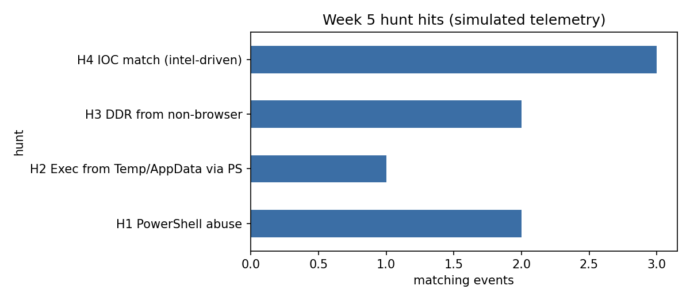

# Week 5 Report: Threat Hunting Concept - Hypothesis-Driven & Intel-Driven Hunting

**Project:** Detection Engineering and Threat Intelligence Analysis of Vidar Stealer
**Assignment 3 (Week 5):** Build a hypothesis-driven hunting scenario and execute hunt queries in ELK/Splunk.

## 1. Objective & Scope
- Understand hunting models: **intel-driven** (start from IOCs/TTPs) and **hypothesis-driven** (start from an assumption about attacker behavior).
- Turn Week 3 (IOCs, Sigma) and Week 4 (Kill Chain -> ATT&CK) results into concrete hunts for Vidar.
- Run the hunt queries in ELK (KQL) with Splunk (SPL) equivalents.

## 2. Hunting Models
| Model | Starting point | Our use |
|---|---|---|
| Intel-driven | Known IOCs / reported TTPs | H4: SHA256 and C2 IP from our dataset (Week 2/3) |
| Hypothesis-driven | "If Vidar was delivered via ClickFix, we should see ..." | H1-H3: PowerShell abuse, execution from Temp/AppData, dead-drop DNS |

## 3. Hunting Scenario (Hypothesis)
> **Main hypothesis:** An employee was lured by a fake "update/CAPTCHA" page (ClickFix) into running a PowerShell command. PowerShell downloaded a Vidar payload into `%TEMP%`/`%APPDATA%`, which then resolved its C2 through Telegram/Steam (Dead Drop Resolver) and connected to a C2 server.

| ID | Sub-hypothesis | Data source | Kill Chain stage | ATT&CK |
|---|---|---|---|---|
| H1 | PowerShell with hidden window / encoded command / download cradle (`iex`, `irm`) | Sysmon EID 1 | Exploitation | T1059.001 |
| H2 | PowerShell spawns an executable from Temp/AppData | Sysmon EID 1 | Installation | T1204.002, T1036 |
| H3 | A non-browser process resolves `t.me` / `telegram.me` / `steamcommunity.com` | Sysmon EID 22 | C2 | T1102.001 |
| H4 | Known IOCs from our dataset (hashes, C2/distribution IPs and domains) appear in telemetry | Sysmon EID 1/3/22 | Delivery / C2 | T1071.001 |

**Hunt process:** hypothesis -> data check -> query -> triage hits -> tune false positives -> pivot on host -> document -> (convert to detection).

## 4. Environment & Data
- ELK 8.15 in Docker (`docker-compose.yml`), index `sysmon-sim`.
- **IOC source:** our normalized dataset `data/vidar_iocs_normalized.csv` (170 rows). Only `to_ids = True` indicators are used for alerting: 120 hashes, 16 IPs, 16 domains; 5 dead-drop hosts (`t.me`, `telegram.me`, `steamcommunity.com`, `ieji.de`, `koyu.space`) feed H3. Loader: `ioc_loader.py`; queries are generated by `build_ioc_queries.py`.
- **Telemetry is simulated** (`generate_logs.py`): ~3000 benign events (browsers, admin scripts, legitimate Steam/Telegram DNS) plus one injected Vidar-like chain on host `WS-04`. Nothing malicious is executed; the lure URL uses `example.invalid`; the payload hash, C2 IP `195.201.250.209` and domain `win11install.com` are taken from our dataset.
- Field names follow ECS (`process.command_line`, `dns.question.name`, ...).

## 5. Hunt Queries
Full queries: `hunt_queries/elk_kql.md` (KQL), `hunt_queries/splunk_spl.txt` (SPL); H4 lists generated from the dataset: `hunt_queries/h4_ioc_kql.md`, `h4_ioc_spl.txt`.

Example (H1, KQL):
```
event.code : "1" and process.name : "powershell.exe" and
process.command_line : (*-enc* or *-encodedcommand* or *hidden* or *iex* or *irm* or *downloadstring*) and
not process.parent.name : "ccmexec.exe"
```

## 6. Results
Reproduce locally: `python3 generate_logs.py && python3 run_hunt.py`

| Hunt | Hits | Host |
|---|---|---|
| H1 PowerShell abuse | 2 | WS-04 |
| H2 Exec from Temp/AppData via PowerShell | 0 | WS-04 |
| H3 DDR lookup from non-browser | 2 | WS-04 |
| H4 IOC match (intel-driven, dataset) | 2 | WS-04 |



**Reconstructed timeline on WS-04 (user user03):** encoded hidden PowerShell from explorer.exe -> `iex (irm ...)` -> `lf3t32pa.exe` from `%TEMP%` -> DNS `telegram.me` and `steamcommunity.com` -> connection to `31.59.44.104:80` (low-confidence candidate, watchlist only) and to `195.201.250.209:443` (high-confidence C2 from dataset) -> self-delete via `cmd /c del`. This matches Kill Chain stages 4-7 from Week 4.

**Kibana screenshots (add real ones):** `screenshots/kibana_h1.png`, `kibana_h3.png`, `kibana_timeline.png`

## 7. Tuning & False Positives
- Naive hunt "any PowerShell start": **509** events. With attack-pattern filter: **3**. After excluding the SCCM client (`ccmexec.exe`, legitimate admin encoded command): **2**.
- H3: browsers, Steam and Telegram clients legitimately resolve these domains, so they are excluded by process name; remaining risk is attackers renaming the process.
- H4 domain IOCs: the dataset contains a URL on `github.com` (fake Adobe installer). Using the host as a domain IOC produced **155** false positives on legitimate DNS, so shared platforms (`github.com`, Telegram, Steam, Mastodon instances) are excluded from domain matching and only the full URL is a valid IOC. Result: 3 true hits.
- `31.59.44.104` (our Week 2 Shodan finding) is `c2_candidate`, confidence low, `to_ids = False` in the dataset, so it is a watchlist item, not an alert. Two Cloudflare IPs are also `to_ids = False`.
- Limitation: hunts depend on Sysmon EID 1/3/22 coverage and PowerShell Script Block Logging (EID 4104) would improve H1.

## 9. Conclusion
Combining both models gives coverage: intel-driven finds known samples quickly but breaks when hashes change daily (repacked WinGo/Krypt), while behavior-based hypotheses (H1-H3) still catch new variants.
